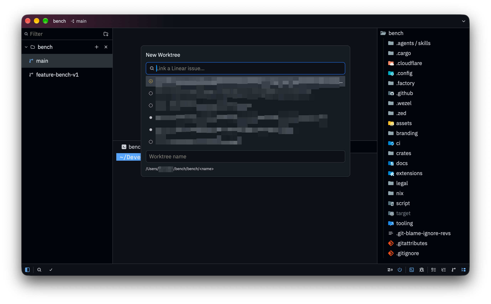
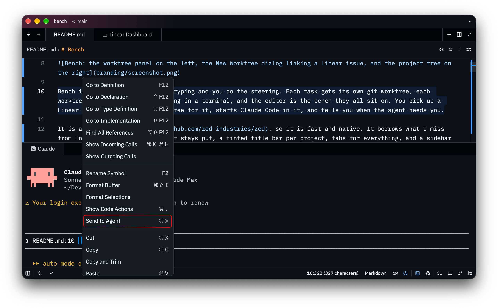
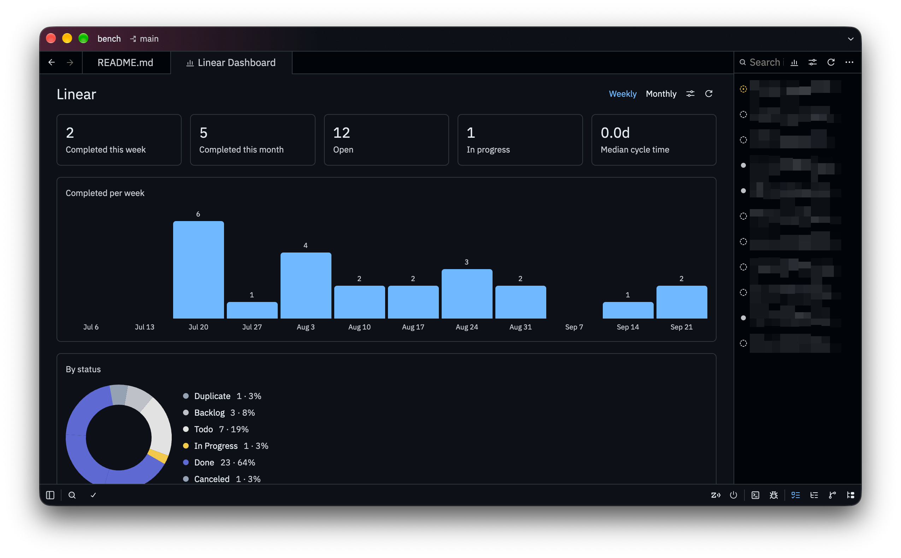

> [!IMPORTANT]
> Remove this line to confirm you've reviewed this PR before submitting.

# Bench

**An agentic IDE, built by an IntelliJ fan, for working across many repositories and many worktrees at once.**



Bench is where the agents do the typing and you do the steering. Each task gets its own git worktree, each worktree gets its own agent running in a terminal, and the editor is the bench they all sit on. You pick up a Linear issue, Bench makes a worktree for it, starts Claude Code in it, and tells you when the agent needs you.

It is a fork of [Zed](https://github.com/zed-industries/zed), so it is fast and native. It borrows what I miss from IntelliJ: a project tree that stays put, a tinted title bar per project, tabs for everything, and a sidebar that answers "what am I working on?" at a glance.

## Worktrees first

Most IDEs treat a worktree as something you open once in a while. Bench treats it as the unit of work.

- **The worktree panel** lists every project you have added and every worktree of each, whether it is open or not. Click one to switch to it, click **+** to create one, hover to delete one. Every worktree lives in one predictable place, `~/bench/<project>/<name>`, and its name is also its branch.
- **Multi-repo projects.** A workspace repository can keep other repositories under something like `repos/`, driven by a manifest. Bench understands this layout. The nested repositories stay visible to the editor, git and language servers, but their worktrees do not clutter the panel. Only your project's own worktrees are listed.
- **Every row tells you what is going on.** Each worktree shows its linked Linear issue and status, whether its pull request is open, merged or closed, and a dot for the agents running in it: working, idle, or waiting for you.
- **Keep `main` in step with its upstream.** When the repository's own checkout has commits to push or pull, its card shows a sync button. It pulls (fast-forward only) and then pushes, and shows git's reason if it cannot.
- **Title bar tinted per worktree**, like IntelliJ's project colours. The colour comes from the worktree's path, so the same worktree is the same colour in every window and after every restart, with nothing to configure.
- **Worktrees made by other tools stay out.** Use `worktree_panel.include` and `worktree_panel.exclude` to limit the panel to your own worktree folders.
- **The sidebar follows you.** The worktree and Linear panels stay open or closed as you move between worktrees, and the worktree panel keeps the same width everywhere.

## Agents in terminals

Bench runs your agents where they already live, in the terminal. It does not replace them with an agent of its own.

- **Terminals survive restarts.** A background terminal host owns every shell. Quitting, crashing or updating Bench leaves your agents running, and each terminal reattaches to the same screen and scrollback when Bench comes back.
- **Bench knows what your agents are doing.** Any terminal running `claude`, `codex`, `gemini` or `aider` is tracked. Bench sends a system notification when an agent stops to ask you something or finishes a turn, and keeps your Mac awake while one is working. Run `agents: install claude hooks` so Claude Code reports its status exactly rather than having Bench infer it from terminal output.
- **Send code to the agent.** Press `cmd->` to send the selection to the Claude Code running in the current worktree. You can also send a file from its tab or the project panel, a commit from the history, a diagnostic straight from the error popover, or a Linear issue's link from its tab or the Issues panel. If no agent is running, Bench starts one. It pastes a mention into the composer and never submits for you.


## Linear, built in

Paste a personal API key once. Bench keeps it in your system keychain, and `LINEAR_API_KEY` works too.

- **Issues panel.** Search your issues and filter them by assignee, status, cycle, project and label, all behind one filter button. Issues are grouped by status unless you choose otherwise.
- **Issues open as tabs.** An issue opens in a tab with its status, assignee, labels, description and comments. **Open in Linear** is one click away.
- **Create a worktree for an issue.** Link an issue in the New Worktree dialog, or use **Create Worktree** on any issue. Bench names the worktree after the branch Linear suggests, moves the issue to *In Progress* and assigns it to you if nobody has it.
- **Send an issue to the agent.** Right-click an issue's tab, or use the sparkle button on its row in the Issues panel, to put the issue's link into the Claude Code composer of the current worktree.
- **Worktrees are linked through their branch name**, the same way Linear links branches, so a worktree you made by hand is linked too. Nothing extra is stored.
- **Dashboard.** See issues completed per week or month, where the rest stand as a donut chart in your teams' own colours, how the current cycle is going, and your median cycle time. It has its own filters.



## Git and GitHub

- **Pull Requests tab** in the git panel, backed by the GitHub CLI you are already signed in to. Bench holds no token of its own.
- **Changed files beside the diff.** The multi-file diff views list the changed files alongside the diff, as a flat list or a tree, and you can click one to jump to it.

## Language support

- **Java and Dart projects nested below the root** get their language servers rooted at the nearest Maven, Gradle or `pubspec.yaml` manifest, not at the top of the repository.
- **Your login shell environment** is captured once and reused, with direnv applied on top, so tools launched from Bench see the same `PATH` as your terminal.

## Less in the way

Bench is single-player, and its collaborators are agents. The collaboration panel button, the sign-in button, the inline assistant, the edit predictions button and the branch name in the title bar (a worktree is already named after its branch) are hidden by default. Menus have a little more room to breathe.

## Getting started

Bench is developed on macOS. To build it and install it into `/Applications`:

```sh
script/with-bench-branding script/bundle-mac -d -i
```

Drop `-d` for a release build. Bench installs next to Zed rather than over it, and keeps its settings in `~/.config/bench`.

Then:

1. Add a project from the worktree panel (the folder icon at the top).
2. Open the Linear panel in the right dock and paste an API key from Linear's *Settings → Security & access*.
3. Press **+** on a project, link an issue, and start working.

Useful settings:

```jsonc
{
  // Only list worktrees kept in Bench's own folder.
  "worktree_panel": { "include": ["~/bench"] },
  // Which terminal commands count as agents, and what Bench does about them.
  "agents": {
    "commands": ["claude", "codex", "gemini", "aider"],
    "notify": true,
    "keep_awake": true
  }
}
```

## Staying close to Zed

Bench tracks upstream Zed closely and keeps its changes easy to merge. New features live in crates of their own where possible, and the Bench name and icon live in `branding/bench.patch`, which is applied only at build time, so merges from upstream never conflict with them. For building on other platforms, see Zed's own guides for [macOS](./docs/src/development/macos.md), [Linux](./docs/src/development/linux.md) and [Windows](./docs/src/development/windows.md).

## License

Bench is based on [Zed](https://github.com/zed-industries/zed) by Zed Industries, Inc. and, like Zed, is licensed primarily under GPL-3.0-or-later, with Apache-2.0 components where marked. See the license files in this repository.
